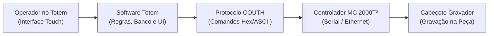
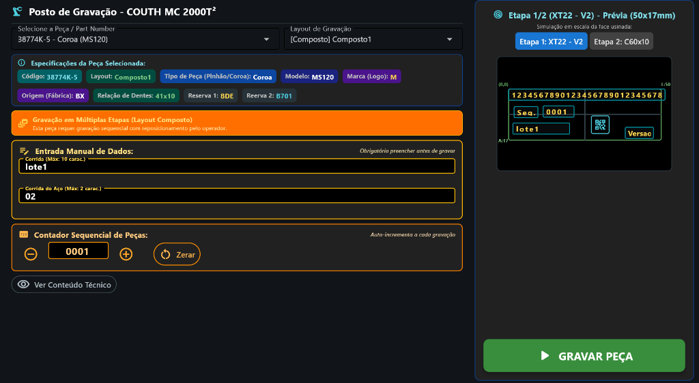
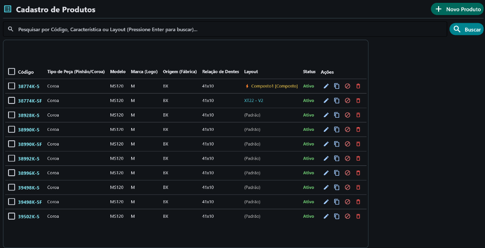
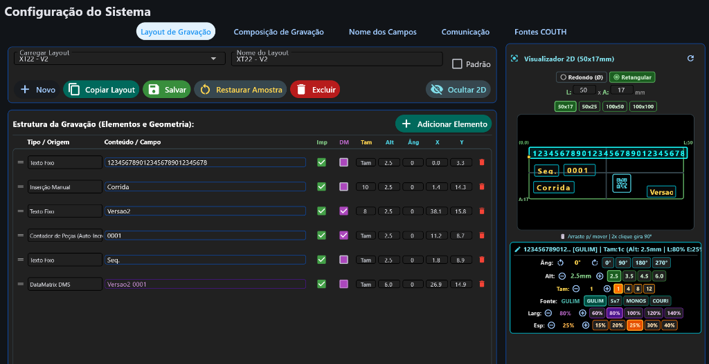
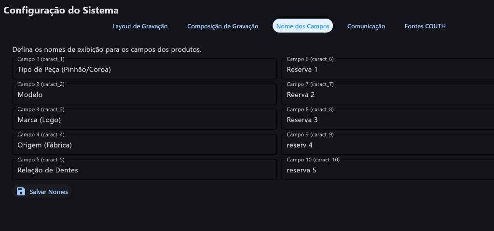

# Manual de Operação e Configuração do Sistema Totem de Gravação
### Sistema Integrado ao Gravador Industrial por Micropuncionamento COUTH MC 2000T²

---

## Sumário
1. [Visão Geral e Funcionamento do Totem](#1-visão-geral-e-funcionamento-do-totem)
   - [1.1. Arquitetura e Propósito](#11-arquitetura-e-propósito)
   - [1.2. Níveis de Acesso e Perfis de Usuário](#12-níveis-de-acesso-e-perfis-de-usuário)
   - [1.3. Conexão e Comunicação com a Unidade COUTH](#13-conexão-e-comunicação-com-a-unidade-couth)
2. [Instruções para Gravação da Peça](#2-instruções-para-gravação-da-peça)
   - [2.1. Visão do Posto de Gravação](#21-visão-do-posto-de-gravação)
   - [2.2. Gravação com Layout Simples (Etapa Única)](#22-gravação-com-layout-simples-etapa-única)
   - [2.3. Gravação com Layout Composto (Múltiplas Etapas com Reposicionamento)](#23-gravação-com-layout-composto-múltiplas-etapas-com-reposicionamento)
   - [2.4. Entradas Manuais e Contador Sequencial de Peças](#24-entradas-manuais-e-contador-sequencial-de-peças)
3. [Cadastro e Gestão de Peças (Produtos)](#3-cadastro-e-gestão-de-peças-produtos)
   - [3.1. Tela de Cadastro de Produtos](#31-tela-de-cadastro-de-produtos)
   - [3.2. Detalhamento dos Campos da Peça](#32-detalhamento-dos-campos-da-peça)
   - [3.3. Associação de Layout (Simples vs Composto)](#33-associação-de-layout-simples-vs-composto)
   - [3.4. Status do Produto e Barra de Ações](#34-status-do-produto-e-barra-de-ações)
4. [Configuração de Layouts de Gravação](#4-configuração-de-layouts-de-gravação)
   - [4.1. Barra Superior e Ações Principais](#41-barra-superior-e-ações-principais)
   - [4.2. Estrutura da Gravação: Tipos de Origem e Conteúdo](#42-estrutura-da-gravação-tipos-de-origem-e-conteúdo)
   - [4.3. Regras das Flags Imp (Imprimir) e DM (DataMatrix)](#43-regras-das-flags-imp-imprimir-e-dm-datamatrix)
   - [4.4. Parâmetros Geométricos: Tam, Alt, Âng, X, Y](#44-parâmetros-geométricos-tam-alt-âng-x-y)
   - [4.5. Visualizador 2D Interativo e Painel Rápido de Propriedades](#45-visualizador-2d-interativo-e-painel-rápido-de-propriedades)
5. [Composição de Gravação e Personalização de Nomes](#5-composição-de-gravação-e-personalização-de-nomes)
   - [5.1. Criação e Edição de Composições em Etapas](#51-criação-e-edição-de-composições-em-etapas)
   - [5.2. Personalização dos Nomes das Características Técnicas](#52-personalização-dos-nomes-das-características-técnicas)
6. [Guia Rápido de Diagnóstico e Mensagens de Erro COUTH](#6-guia-rápido-de-diagnóstico-e-mensagens-de-erro-couth)

---

## 1. Visão Geral e Funcionamento do Totem

### 1.1. Arquitetura e Propósito
O **Totem de Gravação** é uma solução de chão de fábrica desenvolvida para operar em conjunto com os controladores industriais **COUTH MC 2000T²** (tecnologia de micropuncionamento ou riscador pneumático/eletromagnético).

O sistema substitui operações manuais propensas a falhas por um fluxo padronizado, seguro e à prova de erros:
- **Interface Touch-Screen Industrial:** Projetada para uso direto na linha de montagem com botões dimensionados para toques com luvas ($\ge 48\text{ px}$).
- **Banco de Dados Local com Resiliência:** Banco de dados SQLite (`totem_data.db`) com migrações automáticas de schema, backups preventivos automáticos na pasta `backups/` e proteção de configurações essenciais em `local_config.json`.
- **Rastreabilidade Total:** Auditoria de cada gravação efetuada, registrando horário, operador responsável, valores gravados e status retornado pela máquina.



### 1.2. Níveis de Acesso e Perfis de Usuário
O sistema possui controle de acesso por senhas individuais divididas em 3 níveis hierárquicos:

1. **Operador (Nível 1):**
   - Acesso exclusivo ao **Posto de Gravação**.
   - Seleciona peças, preenche dados manuais variáveis (ex: Corrida, Lote), ajusta ou confere o contador e comanda o início da gravação.
   - Pode alterar a sua própria senha de acesso.
2. **Líder de Produção (Nível 2):**
   - Acesso ao **Posto de Gravação** e ao **Cadastro de Produtos**.
   - Cadastra novas peças, duplica modelos, ajusta status e cria **Composições de Gravação**.
3. **Master / Administrador (Nível 3):**
   - Acesso total e irrestrito a todos os módulos do sistema.
   - Configuração de hardware e portas de comunicação (Serial RS232 / TCP-IP Ethernet).
   - Editor de **Layouts de Gravação** e personalização dos nomes de campos.
   - Gestão de usuários (criação, edição e redefinição de senhas).

### 1.3. Conexão e Comunicação com a Unidade COUTH
A comunicação entre o Totem e a unidade COUTH MC 2000T² segue rigorosamente as especificações do protocolo oficial COUTH:
- **Camada Física:** Conexão Serial RS232 (portas COM selecionáveis, 9600 a 115200 bps, 8N1) ou Ethernet TCP/IP (porta padrão 10001).
- **Estrutura de Tramas:** Mensagens em formato binário iniciadas por `STX` (`0x02`), cabeçalho de dispositivo (`DD`), comprimento (`LT`), tipo de unidade (`UT`), código de comando (`CMD`), dados variáveis, checksum (`CRC-16` ou `CheckSum`) e terminador `ETX` (`0x03`).
- **Validação de Retorno:** Cada comando transmitido aguarda resposta positiva (`ACK 0x00`), resposta de marcha (`CMD 0x32`) ou diagnóstico de erro catalogado (ex: erro de posicionamento fora da janela, fonte inexistente).

---

## 2. Instruções para Gravação da Peça

### 2.1. Visão do Posto de Gravação
A tela principal de operação apresenta um layout dividido estrategicamente entre controles operacionais à esquerda e a prévia gráfica em tempo real à direita:



1. **Seletor de Peça / Part Number:** Dropdown com busca rápida por código ou descrição da peça.
2. **Quadro de Especificações Técnicas:** Apresenta instantaneamente todas as características cadastradas da peça (Código, Modelo, Marca/Logo, Relação de Dentes, Fábrica e Reservas).
3. **Banner de Identificação de Modo:** Indica se a peça selecionada usa layout comum ou layout composto em etapas.
4. **Campos de Entrada Manual:** Caixas de texto dinâmicas para preenchimento obrigatório antes da gravação.
5. **Contador Sequencial de Peças:** Exibe o número sequencial atual, com botões para decremento, incremento e zeramento.
6. **Visualizador 2D da Face:** Desenho em escala da peça mostrando exatamente onde cada texto e código DataMatrix serão gravados.
7. **Botão GRAVAR PEÇA:** Botão touch em destaque verde que dispara o ciclo de envio e marcação.

---

### 2.2. Gravação com Layout Simples (Etapa Única)
Para peças convencionais cuja área gravada cabe perfeitamente na janela útil do cabeçote:

1. **Selecionar a Peça:** Toque no campo *"Selecione a Peça / Part Number"* e escolha a peça desejada. Os dados técnicos e o desenho 2D carregarão instantaneamente.
2. **Preencher os Dados Manuais (se houver):** Digite as informações solicitadas (ex: Corrida do Aço). O sistema valida o tamanho máximo de caracteres configurado.
3. **Conferir o Contador:** Verifique se o número exibido no contador de peças corresponde ao lote atual.
4. **Posicionar a Peça:** Coloque a peça no dispositivo de fixação/morsa da gravadora COUTH e trave com segurança.
5. **Pressionar "GRAVAR PEÇA":**
   - O sistema abrirá um diálogo de confirmação.
   - Após a confirmação, o software envia as coordenadas, textos e parâmetros de cabeçote.
   - O comando de marcha é disparado e a gravadora executará a gravação.
   - Ao término com sucesso, um aviso verde confirma a conclusão e o contador de peças é incrementado automaticamente.

---

### 2.3. Gravação com Layout Composto (Múltiplas Etapas com Reposicionamento)
O recurso de **Layout Composto** é utilizado quando a área de gravação da peça excede a janela mecânica do cabeçote (por exemplo, gravar a identificação no início da peça e o código DataMatrix 80 mm adiante):


#### Como Funciona o Ciclo Guiado:
1. Ao selecionar a peça, o sistema exibe o aviso âmbar destacado:
   > **Gravação em Múltiplas Etapas (Layout Composto)**  
   > *Esta peça requer gravação sequencial com reposicionamento pelo operador.*
2. Acima do desenho 2D surgem botões de alternância das etapas:
   - Toque em **`[Etapa 1: XT22 - V2]`** ou **`[Etapa 2: C60x10]`** para inspecionar visualmente o que será gravado em cada momento.
3. Pressione o botão **GRAVAR PEÇA**:
   - Um diálogo detalhado apresenta o resumo de todas as etapas e suas instruções.
   - Confirme para iniciar.
4. **Execução da Etapa 1:**
   - O sistema envia a geometria do Layout da Etapa 1 e executa a primeira marcação física.
5. **Diálogo de Reposicionamento:**
   - A gravadora finaliza a Etapa 1 e entra em repouso.
   - Uma tela modal é exibida ao operador com a instrução específica da etapa:
     > *"Reposicionar peça no segundo batente para concluir gravação."*
   - O operador move a peça na bancada/gabarito e aciona o batente mecânico 2.
6. **Continuação do Ciclo:**
   - O operador toca no botão verde: **`PEÇA REPOSICIONADA — GRAVAR ETAPA 2`**.
   - A Etapa 2 é gravada com precisão.
7. **Finalização:**
   - Ao concluir a última etapa da peça, o contador de peças é incrementado **uma única vez** para a peça finalizada.

---

### 2.4. Entradas Manuais e Contador Sequencial de Peças
- **Entradas Manuais:** Campos como *"Corrida"* e *"Corrida do Aço"* são configurados com limites rígidos de caracteres (ex: Máx. 10 e Máx. 2 caracteres). Caso o operador tente digitar mais caracteres, o campo bloqueia o excesso para impedir que a gravação ultrapasse as bordas da peça.
- **Contador Sequencial de Peças:**
  - Auto-incrementa em 1 a cada peça concluída com sucesso.
  - O botão `+` avança um número (caso uma peça tenha sido descartada).
  - O botão `-` retrocede um número.
  - O botão `Zerar` reseta a contagem para `0001` (com confirmação).

---

## 3. Cadastro e Gestão de Peças (Produtos)

### 3.1. Tela de Cadastro de Produtos
Acessível a Líderes e Administradores, a tela de **Cadastro de Produtos** reúne a listagem completa de itens fabricados, permitindo busca ágil e manutenção preventiva dos dados técnicos:



---

### 3.2. Detalhamento dos Campos da Peça
Ao cadastrar ou editar uma peça pelo botão **`+ Novo Produto`**, os seguintes campos estão disponíveis:

| Campo | Descrição Técnica | Exemplo de Aplicação |
| :--- | :--- | :--- |
| **Código** | Identificador primário (Part Number / Código Comercial da peça). | `38774K-5`, `41285K5F` |
| **Tipo de Peça (`caract_1`)** | Categoria do componente usinado. | `Coroa`, `Pinhão`, `Eixo` |
| **Modelo (`caract_2`)** | Linha de produto ou projeto do conjunto diferencial. | `MS120`, `MS113`, `14X` |
| **Marca / Logo (`caract_3`)** | Letra ou nome do logotipo gravado no componente. | `M` (Meritor), `ARVIN` |
| **Origem / Fábrica (`caract_4`)** | Código da planta ou código da linha de produção. | `BX`, `OSASCO` |
| **Relação de Dentes (`caract_5`)** | Proporção de engrenamento do par pinhão/coroa. | `41x10`, `39x8`, `43x9` |
| **Reservas (`caract_6` a `10`)** | Campos adicionais configuráveis para especificações internas. | `BDE`, `B701` |
| **Layout Associado** | Layout de gravação específico atribuído a esta peça. | *(Ver seção 3.3)* |
| **Status** | Define se o item está apto para gravação em produção. | `Ativo` ou `Inativo` |

> [!NOTE]
> Os títulos exibidos para os campos `caract_1` até `caract_10` podem ser customizados a qualquer momento na aba **Nome dos Campos** das Configurações.

---

### 3.3. Associação de Layout (Simples vs Composto)
O campo **Layout** determina a forma como o Totem conduzirá a gravação da peça:
1. **`(Padrão)`:** A peça utilizará o layout que estiver marcado com o checkbox *"Padrão"* na tela de configuração de layouts.
2. **Layout Simples (ex: `XT22 - V2`):** A peça sempre usará este layout individual, gravando todas as linhas em etapa única.
3. **Layout Composto (ex: `⚡ Composto1 [Composto]`):** Exibido com badge âmbar e ícone de raio, associa a peça a um roteiro de múltiplas etapas sequenciais.

---

### 3.4. Status do Produto e Barra de Ações
Na coluna **Ações** da tabela de produtos:
- **Editar (Ícone de Lápis):** Abre o diálogo modal para alteração de qualquer característica técnica ou do layout associado.
- **Duplicar / Copiar (Ícone de Duas Folhas):** Clona instantaneamente todos os dados da peça selecionada, abrindo o cadastro para que você apenas altere o Código. Ideal para criar variantes de um mesmo modelo.
- **Alternar Status (Ícone de Círculo com Barra):** Alterna o status da peça entre **Ativo** (verde) e **Inativo** (cinza). Peças inativas não aparecem para o operador no Posto de Gravação, evitando erros de seleção de peças descontinuadas.
- **Excluir (Ícone de Lixeira Vermelha):** Remove a peça do banco de dados (com tela de confirmação de segurança).

---

## 4. Configuração de Layouts de Gravação

### 4.1. Barra Superior e Ações Principais
Na aba **Layout de Gravação** da tela de Configurações, o administrador define a geometria, textos, códigos e posições dos elementos gravados:



#### Funções da Barra de Botões:
- **`+ Novo`:** Limpa a grade e o canvas para criar um layout totalmente novo a partir do zero.
- **`Copiar Layout`:** Duplica o layout atualmente carregado sob um novo nome. Perfeito para criar uma versão 2 (`V2`) mantendo o original intacto.
- **`Salvar`:** Grava com segurança toda a tabela de elementos, geometrias e configurações de formato no banco de dados SQLite e gera o backup automático em JSON.
- **`Restaurar Amostra`:** Recarrega o layout de demonstração padrão de fábrica da Meritor (Pinhão/Coroa) com geometrias calibradas.
- **`Excluir`:** Remove o layout selecionado do sistema (layouts associados a produtos ou etapas compostas são validados com aviso impeditivo).
- **`Ocultar 2D` / `Exibir 2D`:** Oculta ou exibe o painel visualizador 2D do lado direito. Ao ocultar, a tabela de elementos expande horizontalmente para edição ampla e confortável em monitores menores.
- **Checkbox `Padrão`:** Define se o layout selecionado é o layout geral do sistema utilizado por todas as peças configuradas como `(Padrão)`.

---

### 4.2. Estrutura da Gravação: Tipos de Origem e Conteúdo
Ao clicar no botão verde **`+ Adicionar Elemento`**, uma nova linha é criada na tabela de estrutura. O sistema oferece diversos tipos de origem de dados:

| Tipo / Origem | O que Informar no Campo "Conteúdo / Campo" | Comportamento na Peça |
| :--- | :--- | :--- |
| **Texto Fixo** (`literal`) | O texto exato desejado (ex: `1234567890`, `Seq.`, `MADE IN BRAZIL`). Suporta também interpolação dinâmica usando chaves `{codigo}`, `{caract_1}`. | Grava a string literal exata na peça. |
| **Campo do Produto** (`field`) | O identificador técnico da característica: `codigo`, `caract_1`, `caract_2`, `caract_3`, etc. | Busca o valor correspondente cadastrado na peça selecionada pelo operador e grava seu conteúdo. |
| **Inserção Manual** (`manual`) | O rótulo da variável exibido ao operador (ex: `Corrida`, `Lote Tratamento`, `Operador`). | Cria automaticamente uma caixa de texto no Posto de Gravação exigindo que o operador digite o valor antes de gravar. |
| **Contador de Peças (Auto-Incr)** | O valor numérico inicial com preenchimento de zeros (ex: `0001`). | Insere o valor atual do contador sequencial e o incrementa automaticamente ao término da gravação. |
| **Contador COUTH Interno** (`contador1`) | O número inicial do registrador (ex: `0001`). | Aciona o contador interno do hardware COUTH via comando `\x1eCT1(...)\x1f`. |
| **Data DD-MM-AAAA** | Padrão COUTH `\x1eC(dd-mm-yyyy)\x1f`. | Grava a data atual no formato brasileiro dia-mês-ano. |
| **Data AAAA-MM-DD** | Padrão COUTH `\x1eC(yyyy-mm-dd)\x1f`. | Grava a data no padrão internacional ano-mês-dia. |
| **Hora HH-MM** | Padrão COUTH `\x1eC(HH-MM)\x1f`. | Grava a hora e minuto do momento exato da marcação. |
| **Turno** | Padrão COUTH `\x1eT\x1f`. | Grava o turno de trabalho conforme configurado no controlador COUTH. |
| **Logotipo COUTH** (`logo`) | O nome do arquivo gravado na memória da máquina (ex: `M.LOG`). | Punciona o arquivo gráfico/logo vetorial residente no controlador COUTH. |
| **DataMatrix DMS** | *(Vazio ou campos extras)*. | Gera um código bidimensional **Quadrado** via comando `\x1eDMS(...)\x1f`. Se houver itens com `DM` marcado, monta o conteúdo automaticamente. |
| **DataMatrix DMR** | *(Vazio ou campos extras)*. | Gera um código bidimensional **Retangular** via comando `\x1eDMR(...)\x1f` para áreas estreitas. |
| **Quebra de Linha** | *(Não se aplica)*. | Força uma quebra física de linha de texto na programação COUTH. |

---

### 4.3. Regras das Flags Imp (Imprimir) e DM (DataMatrix)
Na tabela de elementos existem duas colunas fundamentais:

```text
[Tipo / Origem]  [Conteúdo / Campo]   [Imp]   [DM]   [Tam]  [Alt]  [Âng]   [X]    [Y]
Texto Fixo       123456789012345678    [✓]     [ ]    Tam    2.5    0     0.0    3.3
Texto Fixo       Versao2               [✓]     [✓]     8     2.5    0    38.1   15.8
Inserção Manual  Corrida               [ ]     [✓]    10     2.5    0     1.1   14.3
DataMatrix DMS   Versao2 0001          [✓]     [ ]    Tam    6.0    0    26.9   11.9
```

#### 1. Flag `Imp` (Imprimir - Checkbox Verde):
- **Marcado (`True`, padrão):** O campo é gravado fisicamente em caracteres alfanuméricos na peça e desenhado em escala na prévia 2D.
- **Desmarcado (`False`):** O campo **NÃO** é gravado fisicamente pelo cabeçote e **NÃO** aparece no desenho da peça. Permanece no layout como campo informativo ou como fonte de dados para o código DataMatrix.

#### 2. Flag `DM` (DataMatrix - Checkbox Roxo):
- **Marcado (`True`):** O conteúdo deste campo é extraído e concatenado automaticamente na composição do código bidimensional DataMatrix.
- **Desmarcado (`False`):** O campo não participa do DataMatrix.

> [!IMPORTANT]
> **Campos Exclusivos do DataMatrix (`Imp = False` e `DM = True`):**  
> Quando você precisa que uma informação confidencial ou técnica (ex: lote interno, corrida ou chave de rastreabilidade) esteja codificada no DataMatrix 2D, mas **sem poluir visualmente a peça** com texto gravado a olho nu:
> - Deixe `Imp` **desmarcado**;
> - Deixe `DM` **marcado**.  
> O Totem colocará o dado dentro do DataMatrix, mas o cabeçote não gravará nenhuma linha de texto para ele!

---

### 4.4. Parâmetros Geométricos: Tam, Alt, Âng, X, Y
Cada elemento configurado possui parâmetros numéricos precisos:
- **`Tam` (Tamanho Máximo / Truncamento):** Limita a quantidade de caracteres do campo (ex: `10`). Evita que textos longos estourem a margem da peça. Em contadores, define o preenchimento de zeros à esquerda (ex: `4` gera `0001`).
- **`Alt` (Altura em mm):** Altura física dos caracteres em milímetros (ex: `2.5`, `3.5`, `6.0`).
- **`Âng` (Ângulo em Graus):** Inclinação da linha de gravação:
  - `0°`: Gravação horizontal normal (esquerda para a direita).
  - `90°`: Gravação vertical ascendente.
  - `180°`: Gravação invertida de ponta-cabeça.
  - `270°`: Gravação vertical descendente.
- **`X` (Posição X em mm):** Distância horizontal a partir da origem `(0,0)` até o início do texto.
- **`Y` (Posição Y em mm):** Distância vertical a partir da origem `(0,0)` até a linha-base do texto.

---

### 4.5. Visualizador 2D Interativo e Painel Rápido de Propriedades
O painel direito reproduz fielmente a área útil da peça com ferramentas interativas:


1. **Formato da Face:**
   - **`Redondo (Ø)`:** Para peças circulares (pinhões, coroas, eixos). Permite definir o Diâmetro externo e o Raio não gravável (furo central).
   - **`Retangular`:** Para peças planas e plaquetas de identificação. Permite definir Largura (`L`) e Altura (`A`) em mm.
   - **Botões de Janela Rápida:** Atalhos para as janelas padrão COUTH: `50x17`, `50x25`, `100x50`, `100x100 mm`.
2. **Canvas Interativo:**
   - **Arrastar e Soltar:** Clique sobre qualquer elemento e arraste-o com o mouse ou toque na tela para ajustar as coordenadas `X` e `Y` visualmente.
   - **Duplo Clique:** Gira o elemento rapidamente em `90°`.
3. **Painel de Propriedades do Elemento Selecionado:**
   - **Ajuste de Ângulo:** Botões rápidos `0°`, `90°`, `180°`, `270°` e botões de ajuste fino.
   - **Ajuste de Altura:** Botões de clique rápido: `2.5`, `3.5`, `4.5`, `6.0 mm`.
   - **Limite de Caracteres (`Tam`):** Botões rápidos `1`, `4`, `8`, `12`.
   - **Fonte COUTH:** Seleção das tipografias gravadas no controlador: `GULIM` (traço linear contínuo), `5x7` (matriz de 5x7 micropontos), `MONOS` (monoespaçada) ou `COURI` (estilo máquina).
   - **Largura (%):** Comprime ou expande os caracteres horizontalmente (`60%`, `80%`, `100%`, `120%`, `140%`).
   - **Espaçamento (%):** Ajusta a distância entre letras sucessivas (`15%`, `20%`, `25%`, `30%`, `40%`).

---

## 5. Composição de Gravação e Personalização de Nomes

### 5.1. Criação e Edição de Composições em Etapas
Na aba **Composição de Gravação**, o líder ou administrador combina layouts simples em um roteiro sequencial com instruções de posicionamento mecânico:

![Figura 4: Composição de Gravação]fig4_composicao_gravacao.png)

#### Passo a Passo para Criar uma Composição:
1. Clique em **`+ Nova Composição`**.
2. Digite o **Nome da Composição** (ex: `Composto1`).
3. Para cada etapa necessária:
   - Clique em **`+ Adicionar Etapa`**.
   - No campo **Layout da Etapa**, selecione o layout simples previamente calibrado (ex: `Etapa 1: XT22 - V2`, `Etapa 2: C60x10`).
   - No campo **Instrução ao Operador**, digite a orientação clara para o operador na linha (ex: *"Posicionar peça no primeiro batente e iniciar gravação."* e *"Reposicionar peça no segundo batente para concluir gravação."*).
   - Utilize as setas para cima (**↑**) e para baixo (**↓**) caso precise reordenar a sequência de execução.
4. Clique no botão verde **`Salvar Composição`**.
5. A nova composição fica imediatamente disponível no cadastro de produtos com o selo `[Composto]`.

---

### 5.2. Personalização dos Nomes das Características Técnicas
Na aba **Nome dos Campos**, o administrador adequa os termos do sistema ao vocabulário da sua empresa:



- O sistema disponibiliza 10 campos genéricos (`caract_1` até `caract_10`).
- Você pode renomeá-los livremente:
  - `Campo 1`: `Tipo de Peça (Pinhão/Coroa)`
  - `Campo 2`: `Modelo`
  - `Campo 3`: `Marca (Logo)`
  - `Campo 4`: `Origem (Fábrica)`
  - `Campo 5`: `Relação de Dentes`
  - `Campo 6 a 10`: `Reserva 1` até `Reserva 5`
- Ao clicar em **`Salvar Nomes`**, os novos rótulos são aplicados imediatamente em todas as telas (Cadastro de Peças, Posto de Gravação e relatórios de auditoria) e protegidos no arquivo de configuração local.

---

## 6. Guia Rápido de Diagnóstico e Mensagens de Erro COUTH

| Mensagem do Sistema / Código | Causa Provável | Ação Recomendada |
| :--- | :--- | :--- |
| **Erro de posicionamento: O texto excede os limites (0x04)** | As coordenadas `X` ou `Y`, somadas à largura/altura do texto, ultrapassam a janela mecânica (ex: > 50 mm). | No editor de layout, reduza a coordenada `X`, diminua a altura dos caracteres ou configure um limite de tamanho (`Tam`). |
| **Erro de posicionamento: DataMatrix excede limites (0x06)** | O bloco DataMatrix foi posicionado muito perto da borda da janela. | Mova o DataMatrix para dentro da área útil (mínimo de 3 mm de margem em relação à borda). |
| **Erro mecânico: Origem não detectada (0x07)** | O cabeçote da gravadora não alcançou os fins de curso (home position). | Verifique se não há obstrução mecânica ou cabos travando o movimento dos eixos X/Y da máquina. |
| **Fonte não encontrada no controlador (0x08)** | O layout solicita uma fonte que não está instalada na memória do MC 2000T². | Selecione `GULIM` ou `MS5X7` nas propriedades da fonte no editor de layout. |
| **Timeout de comunicação / Sem resposta da máquina** | Cabo serial desconectado, porta COM incorreta ou cabo Ethernet desconectado. | Na aba Comunicação, teste a conexão ou verifique o cabo e o endereço IP da gravadora. |
